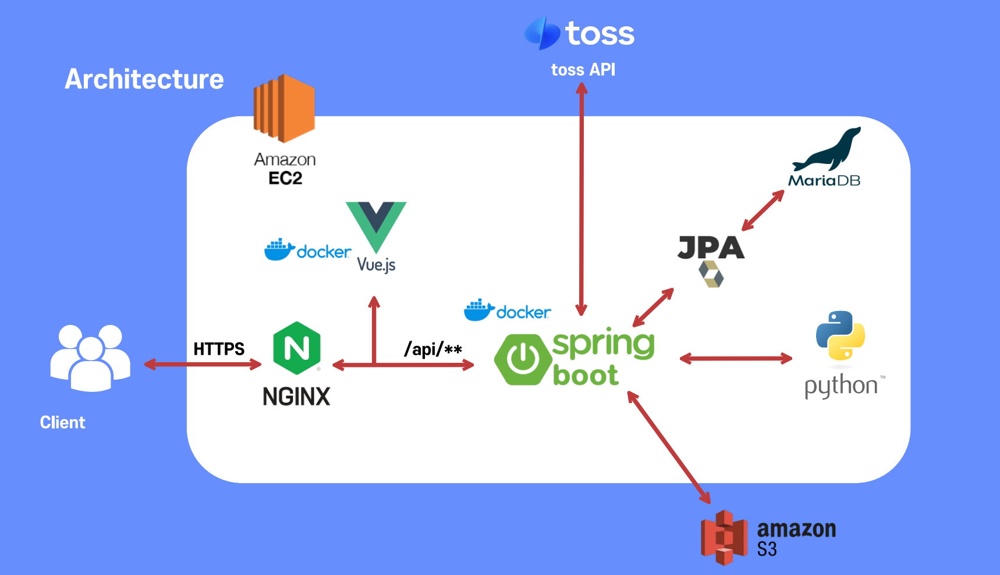

# 1. SSMART-CART 소개

  ### **쇼핑을 쾌적하게, 스마트 카트 프로젝트**
    
  - 기간: 24.01.08 ~ 24.02.16 (6주)
  - 인원: 6명(Embedded_2, FE_3, BE_1)
  - 트랙: 웹 IoT

  ### 주요 기능
  
**쾌적한 쇼핑을 위한 스마트 카트**

- 지문 시스템으로 인한 로그인 간소화
- 바코드 리더기를 연결하여 카트에서 바로 장바구니에 담기 기능
- 현재 특별 할인 상품과 상품 위치 알려주는 기능
- UWB를 활용한 결제 자동화
- 웹에서 미리 찜 물품 등록
- 관리자는 웹에서 물품 수정 및 등록 가능

------------------------------------------------------
  
# 2. 🔍 개발 환경
  
## 2-1. 환경 설정
    
  ### **👨‍💻 Front-end**
    
    - Visual Studio Code : 1.85.1
    - node.js version : 20.10.0
    - Vue.js : @vue/cli 5.0.8
    - Axios : 1.6.7
    - Pinia : 2.1.7

  ### **👨‍💻 Back-end**
    
    - Intellij : `2024.3.2`
    - JVM OpenJDK : `17`
    - JWT : `0.11.5`
    - Spring Boot : `3.2.1`
      - JAVA Spring Data JPA
      - Spring Security
    - Gradle
    - ORM : JPA
    
  ### **👩‍💻 인프라**  
    
    - AWS EC2
      - Nginx : `1.18.0`
      - Ubuntu : `20.04 LTS`
      - Docker : `25.0.2`
    - Docker Hub
      
  

## 2-2. 서비스 아키텍처
  


## 2-3 ERD


------------------------------------------------------  

# 3. 🦈 주요 기능
------------------------------------------------------
  ## 3-1. ssamart-cart 지문 로그인


  사용자 편의를 위한 지문 로그인 기능!

  - 웹 화면에서 회원 가입을 먼저 진행합니다.
  - 디바이스로 접속 시 일반 로그인 or 지문 로그인 선택 가능합니다.
  - 리문 로그인 시 지문을 등록하거나 지문 로그인을 진행할 수 있습니다.
  - 일반 로그인 시 비밀번호를 입력하여 로그인을 진행합니다.

  ## 3-2. ssamart-cart 장바구니

  
  카트에서 바로 장바구니에 담음으로써 결제 대기 최소화!
  
  - 바코드 리더기로 상품을 찍으면 장바구니에 담겨집니다.
  - 디바이스 내에서 상품을 취소하거나 수량을 증가사킬 수 있습니다.

  ## 3-3. ssamart-cart 쇼핑편의기능

  - 현재 게임중인 친구의 라이브 채팅방 입장
  - 친구들의 새로 올라온 도감 확인
  - 프로필 페이지, 아이템샵, 메세지함, 알림 확인
  - 앱 다운로드 및 서비스 약관 확인
  - 친구 찾기

  ## 3-4. ssamart-cart 메뉴추천 

  - 일반 채팅
  - 사진 채팅
  - 친구 도감 채팅
  - 채팅시 친구한테 window 알림 기능

  ## 3-5. ssamart-cart 위치안내

  - 프로필 주인 도감 확인
  - 프로필 주인 명예의 전당(칭호) 확인
  - 프로필 편집

  ## 3-6. ssamart-cart 결제

  - 새 도감 알림시 도감으로 이동
  - 새 칭호 알림시 프로필로 이동
  - 새 댓글 알림시 도감으로 이동
  - 친구 요청시 친구 프로필로 이동

--------------------------

# 4. 🛡 배포
------------------------------------------------------
  - https
    - certbot과 Nginx를 통한 SSL 인증
  - Docker
    - Docker container를 이용하여 프론트, 백엔드 배포
-> run
    - Nginx로 reverse proxy 설정
    
--------------------------


# 5. 🖊 Cooperation
------------------------------------------------------
  
  ## Tools
```
    - Git

    - Jira

    - Notion

    - Mattermost
```
--------------------------

# 6. Ground rule
--------------------------------------------

  ## Commit Convention
  ```
# --- COMMIT END ---
# <타입> 리스트
#   Feat    : 기능 (새로운 기능)
#   Fix     : 버그 (버그 수정)
#   Refactor: 리팩토링
#   Test    : 테스트 (테스트 코드 추가, 수정, 삭제: 비즈니스 로직에 변경 없음)
#   Chore   : 기타 변경사항 (빌드 스크립트 수정 등 자잘한 수정들)
#   Style   : 세미콜론 추가, 변수명 변경, 주석 추가/제거
#   Docs    : 파일, 문서(이미지 등) 추가, 삭제
#   Build   : 빌드 관련 파일 수정
#   CI      : CI 관련 설정 수정
  ```

# 7. 👨‍👩‍👧‍👦 팀원 소개
------------------------------------------------------
# 팀원 역할 및 담당


